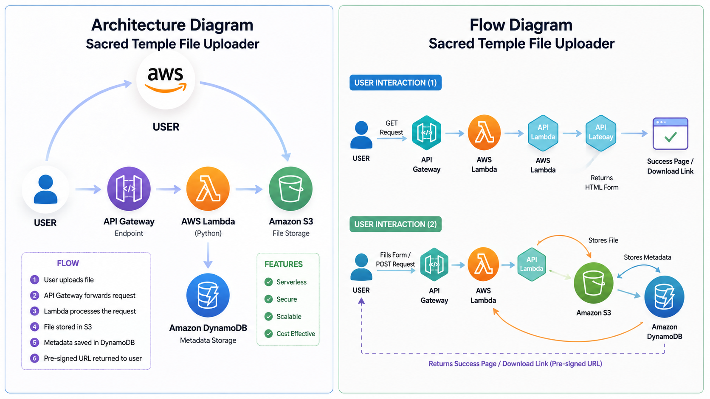
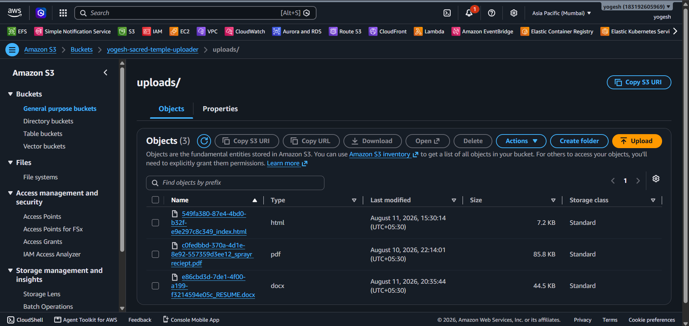
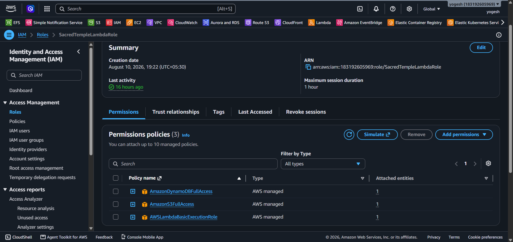
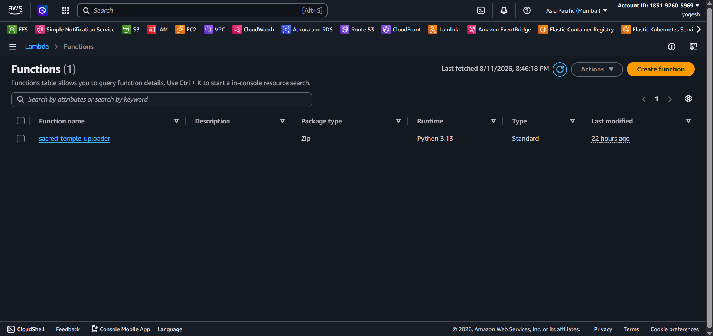
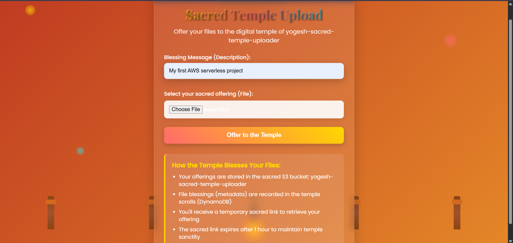
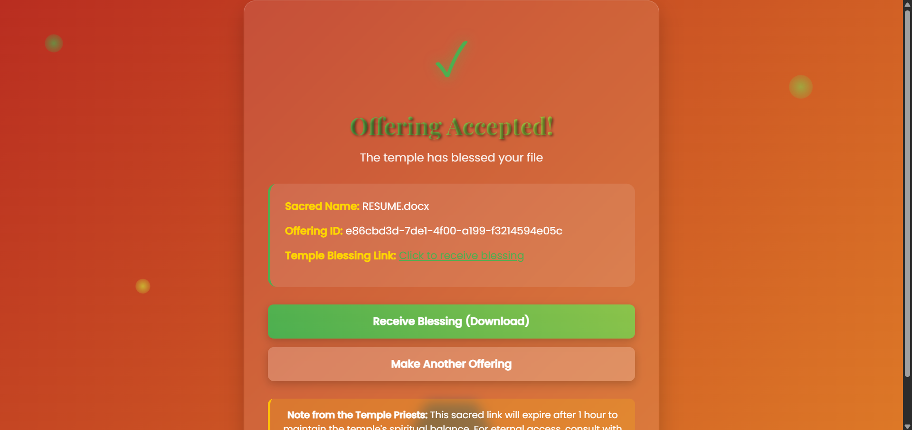

# project--Serverless-application--Sacred-Temple-File-Uploader
 

<h2>Quick Overview to Understand The Flow</h2>

<h4>
1. Create a Lambda function. 

2. Create a bucket in Amazon S3. 

3. Create a DynamoDB table. 

4. Develop suitable Python code for the project in the Lambda function and deploy it. 

5. Add suitable IAM permissions to the Lambda execution role. 
To do this: Lambda Function → Configuration → Permissions → Execution Role → Edit/Manage IAM permissions. 

6. Create an HTTP API using Amazon API Gateway and integrate it with the Lambda function. 

7. Configure the API route as <b>ANY /</b> and use the Lambda function as the integration target. 

8. Use the <b>$default</b> stage with Auto-deploy enabled. 

9. Copy the API Gateway URL and open it in a web browser. 
The Sacred Temple File Uploader application will open in the browser. 

10. Upload a file and provide a description. The file will be stored in the S3 bucket and its metadata will be stored in DynamoDB. 
</h4>

 
<h1>📌 Introduction</h1>

<h3>
A beautiful temple-themed serverless file upload system built with AWS Lambda.
Users can upload files through a web interface, where the files are securely stored in an Amazon S3 bucket and their metadata is stored in Amazon DynamoDB.
The application features an animated temple design, floating elements, and a sacred-themed UI.
</h3>

## Features

- 🏯 Temple-inspired animated design with floating elements
- 📁 Secure file upload to Amazon S3
- 💾 Metadata storage in Amazon DynamoDB
- 🔗 Auto-generated pre-signed URLs for temporary file access
- 📱 Responsive design for different screen sizes
- ⏳ 1-hour temporary download links for security
- ⚡ Serverless architecture using AWS Lambda and API Gateway

## Tech Stack

- **Backend**: AWS Lambda (Python)
- **API**: Amazon API Gateway (HTTP API)
- **Storage**: Amazon S3 (`yogesh-sacred-temple-uploader`)
- **Database**: Amazon DynamoDB (`sacred-temple-files`)
- **Frontend**: HTML5, CSS3, JavaScript
- **Styling**: Custom CSS with animations

# 🌐 Architecture Overview

## **High-Level Design**

---

## **AWS Components and Purpose**

| **Component**       | **AWS Service**      | **Description / Purpose**                                                              |
| ------------------- | -------------------- | -------------------------------------------------------------------------------------- |
| 🗂 **File Storage** | **Amazon S3**        | Stores files uploaded by users securely and reliably.                                  |
| ⚡ **Compute**       | **AWS Lambda**       | Serverless backend that processes upload requests and communicates with S3 and DynamoDB. |
| 🌐 **API**           | **Amazon API Gateway** | Provides an HTTP API endpoint and routes user requests to the Lambda function.         |
| 📊 **Database**     | **Amazon DynamoDB**  | Stores metadata of uploaded files such as file ID, filename, description, and S3 key.  |
| 🔐 **Security**     | **AWS IAM**          | Controls permissions required by Lambda to access S3, DynamoDB, and other AWS services. |

---

## **Workflow Summary**

1. **User Opens the Application** → The user accesses the API Gateway URL through a web browser.

2. **API Gateway** → Receives the HTTP request and routes it to the **AWS Lambda** function.

3. **Lambda Function** → Displays the upload form for GET requests and processes file uploads for POST requests.

4. **Amazon S3** → Lambda uploads the selected file to the S3 bucket:
   `yogesh-sacred-temple-uploader`

5. **DynamoDB** → Lambda stores the uploaded file's metadata in:
   `sacred-temple-files`

6. **Pre-signed URL** → Lambda generates a temporary URL that can be used to access the uploaded file.

7. **Lambda → API Gateway → User** → The application returns a success page containing the file information and temporary download link.
---

# ⚙️ 2. AWS Services Configuration

## **2.1 Amazon S3 Bucket Setup**

The **Amazon S3 bucket** is used for **secure file storage**. Uploaded files are stored in the S3 bucket, and temporary pre-signed URLs are generated to provide controlled access to the uploaded files.

---

### 📝 **Configuration Details**

| **Setting**          | **Value**                              | **Purpose**                                            |
| -------------------- | -------------------------------------- | ------------------------------------------------------ |
| **Bucket Name**      | `yogesh-sacred-temple-uploader`        | Stores files uploaded through the application.         |
| **Region**           | `ap-south-1` *(Asia Pacific - Mumbai)* | AWS region where the bucket is created.                |
| **Access Control**   | **Private**                            | Prevents public access to uploaded files by default.   |
| **Temporary URL**    | **Enabled** via pre-signed URLs        | Provides time-limited access to specific uploaded files. |
| **Lifecycle Policy** | **Not configured**                     | Files are not automatically deleted using an S3 lifecycle rule. |

---

### 🚀 **Step-by-Step Setup Guide**

1. **Open AWS Console** → Navigate to **Amazon S3**.

2. **Click “Create Bucket”**.

3. Enter the **Bucket Name**:
   - `yogesh-sacred-temple-uploader`

4. Select **Region**:
   - `ap-south-1 (Asia Pacific - Mumbai)`

5. Keep **“Block all public access” enabled**.
   - The bucket can remain private because the Lambda function generates temporary pre-signed URLs for file access.

6. **Bucket Versioning**:
   - Optional. Enable it if you want to keep previous versions of uploaded files.

7. Click **“Create Bucket”** to finalize.

8. Configure the required **IAM permissions** for the Lambda execution role so that Lambda can upload files to the S3 bucket and generate pre-signed URLs.

9. Use the S3 bucket:
   - Bucket: `yogesh-sacred-temple-uploader`
   - Folder: `uploads/`  

---

### 📸 **Visual Reference**

---
## **2.2 Amazon DynamoDB Table Setup**

The **Amazon DynamoDB table** is used to store **metadata of uploaded files**. It stores information such as the file ID, filename, description, S3 object key, upload information, and pre-signed URL.

DynamoDB provides a **serverless, highly scalable NoSQL database** for the application.

---

### 📝 **Configuration Details**

| **Setting**       | **Value**                  | **Purpose**                                                |
| ----------------- | -------------------------- | ---------------------------------------------------------- |
| **Table Name**    | `sacred-temple-files`      | Stores metadata of uploaded files.                         |
| **Partition Key** | `id (String)`              | Unique identifier for each uploaded file.                  |
| **Capacity Mode** | `On-Demand`                | Automatically manages read and write capacity based on usage. |
| **Encryption**    | **AWS Owned Key**          | Encrypts data at rest by default.                          |
| **Backup**        | **Default / Not Configured** | Backup settings depend on the configuration of the table. |

---

### 📂 **Data Stored in DynamoDB**

Each record in the table stores metadata related to the uploaded file:

| **Field**          | **Type** | **Description**                                      |
| ------------------ | -------- | ---------------------------------------------------- |
| `id`               | String   | Unique identifier generated for each uploaded file. |
| `filename`         | String   | Original name of the uploaded file.                 |
| `description`      | String   | Description or message provided with the file.      |
| `s3_key`           | String   | S3 object key where the uploaded file is stored.    |
| `upload_date`      | String   | Stores the Lambda request ID associated with upload.|
| `presigned_url`    | String   | Temporary URL used to access the uploaded file.     |

---

### 🚀 **Step-by-Step Setup Guide**

1. **Open AWS Console** → Navigate to **DynamoDB Service**.

2. Click **Create Table**.

3. Configure the basic settings:
   - **Table Name:** `sacred-temple-files`
   - **Partition Key:** `id`
   - **Partition Key Type:** `String`

4. Under **Capacity Mode**, select:
   - **On-Demand**

5. Keep the default encryption settings unless you have configured a different encryption key.

6. **Point-in-Time Recovery** is optional. Enable it only if you have configured it in your DynamoDB table.

7. Click **Create Table** to finalize. 

---

### 📸 **Visual Reference**

| **S3 Bucket (Storage)**        | **DynamoDB (Metadata)**            |
|--------------------------------|------------------------------------|
|  |   |

---

## **2.3 IAM Policies and Roles**

The **IAM Execution Role** allows the AWS Lambda function to securely interact with Amazon S3, Amazon DynamoDB, and Amazon CloudWatch without storing AWS credentials inside the application code.

The role provides the permissions required for the Lambda function to perform its tasks.

---

### 📝 **Configuration Details**

| **Setting**           | **Value**                     | **Purpose**                                                      |
| --------------------- | ----------------------------- | ---------------------------------------------------------------- |
| **Execution Role**    | Lambda Execution Role         | Allows Lambda to access required AWS services.                   |
| **Managed Policy #1** | `AWSLambdaBasicExecutionRole` | Allows Lambda to write execution logs to CloudWatch.             |
| **Managed Policy #2** | `AmazonS3FullAccess`           | Allows Lambda to access and upload objects to Amazon S3.         |
| **Managed Policy #3** | `AmazonDynamoDBFullAccess`     | Allows Lambda to write and manage data in DynamoDB.              |

---

### 🔐 **Purpose of IAM Role**

| **Component**         | **Access Granted**                  | **Why It's Needed**                                      |
| --------------------- | ----------------------------------- | -------------------------------------------------------- |
| **Lambda → S3**       | S3 object access                    | Upload files and generate pre-signed URLs.               |
| **Lambda → DynamoDB** | DynamoDB access                     | Store metadata of uploaded files.                        |
| **Lambda → CloudWatch** | Log access                        | Monitor Lambda execution and troubleshoot errors.        |

---

### 🔒 **Security Note**

For a production environment, it is recommended to follow the **Principle of Least Privilege** and grant Lambda only the specific S3 and DynamoDB permissions required by the application.
---

### 🚀 **Step-by-Step Setup Guide**

1. **Open AWS Console** → Navigate to **IAM Service**.

2. Click **Roles** → **Create Role**.

3. **Choose Trusted Entity:**
   - **AWS Service** → Select **Lambda**.

4. **Attach Managed Policies:**
   - `AWSLambdaBasicExecutionRole` *(for Lambda execution and logging)*
   - `AmazonS3FullAccess` *(for S3 bucket operations)*
   - `AmazonDynamoDBFullAccess` *(for DynamoDB access)*

5. **Review and Create Role.**

6. Assign this role to your **Lambda function** under:
   **Lambda → Function → Configuration → Permissions → Execution role**.

---

### 📸 **Visual Reference**

| **IAM Role Diagram** |
|----------------------|
|  |

---
# 🔄 3. Application Workflow

The application follows a **serverless file upload flow**, where users can upload files through an API endpoint. The uploaded files are stored in Amazon S3, while their metadata is stored in Amazon DynamoDB.

---

## **📂 File Upload Process**

| **Step** | **Action**             | **AWS Service Involved** | **Outcome**                                                       |
| -------- | ---------------------- | ------------------------ | ----------------------------------------------------------------- |
| **1️⃣**  | **User Interface**     | HTML, CSS, JavaScript    | User selects a file and enters an optional description.           |
| **2️⃣**  | **API Request**         | Amazon API Gateway       | Sends the user's HTTP request to the Lambda function.             |
| **3️⃣**  | **File Processing**     | AWS Lambda               | Lambda processes the multipart form-data request.                |
| **4️⃣**  | **S3 Storage**          | Amazon S3                | File is uploaded to the S3 bucket with a unique file ID.          |
| **5️⃣**  | **Metadata Recording**  | Amazon DynamoDB          | File metadata is stored in the DynamoDB table.                    |
| **6️⃣**  | **URL Generation**      | AWS Lambda + Amazon S3   | Lambda generates a temporary pre-signed URL for the uploaded file.|
| **7️⃣**  | **User Feedback**       | API Gateway → Web App    | User receives an upload success page with a download link.       |

---

### 🚀 **Workflow in Action**

1. **User opens the API URL** in a web browser.

2. **Lambda displays the upload form** containing:
   - Description field
   - File selection field
   - Upload button

3. **User selects a file** and clicks **"Offer to the Temple"**.

4. **API Gateway** sends the request to **AWS Lambda**.

5. **Lambda**:
   - Generates a unique file ID.
   - Processes the uploaded file.
   - Uploads the file to **Amazon S3**.
   - Stores file metadata in **Amazon DynamoDB**.

6. **Lambda generates a pre-signed URL** that is valid for **1 hour**.

7. **Lambda returns a success page** containing:
   - Uploaded filename
   - File ID
   - Temporary download link

8. The user can click the **download link** to access the uploaded file.

---

# 🛡️ 4. Temporary URL Mechanism

Secure file access is achieved using **pre-signed S3 URLs** with **1-hour expiration**, providing temporary access to uploaded files.

| **Feature**              | **Purpose**                                             |
| ------------------------ | ------------------------------------------------------- |
| ⏳ **1-Hour Expiration**  | Limits link validity to prevent unauthorized access.    |
| 🔒 **Private S3 Storage** | Files are stored in the configured S3 bucket.           |
| 🚀 **Secure Sharing**     | Temporary links are generated by the Lambda function.   |
| 🔗 **Temporary Access**   | Users can access the uploaded file through the URL.     |

---

# 🔐 5. Security Features

The application uses **AWS IAM permissions** and **pre-signed S3 URLs** to provide controlled access to uploaded files and AWS resources.

---

## **5.1 Access Control**

| **Control**                  | **Implementation**                                      |
| ---------------------------- | ------------------------------------------------------- |
| 🧑‍💻 **IAM Role**              | Allows Lambda to access S3 and DynamoDB resources.      |
| 🚫 **S3 Access Control**      | Uploaded files are stored in the configured S3 bucket.  |
| 🗂 **DynamoDB Access**        | Lambda stores file metadata in the DynamoDB table.      |

---

## **5.2 Data Protection**

| **Feature**                  | **Benefit**                                      |
| ---------------------------- | ----------------------------------------------- |
| ⏳ **Temporary URLs**         | Provides time-limited access to uploaded files. |
| 🔒 **S3 Storage**             | Stores uploaded files in Amazon S3.             |
| 🗄 **DynamoDB Metadata**      | Stores information about uploaded files.        |

---

# ⚡ 5.3 Lambda Function Deployment

The **Lambda function** handles file upload requests, stores files in **Amazon S3**, saves file metadata in **Amazon DynamoDB**, and generates **temporary pre-signed URLs** for file access.

---

### 🖥️ **Configuration**

| **Setting**               | **Value / Description**                              |
| ------------------------- | ---------------------------------------------------- |
| **Runtime**               | Python                                                |
| **Handler**               | `lambda_function.lambda_handler`                     |
| **S3 Bucket**             | `yogesh-sacred-temple-uploader`                      |
| **DynamoDB Table**        | `sacred-temple-files`                                |
| **URL Expiration**        | `3600 seconds` *(1 hour)*                            |

---

### 📂 **Lambda File Overview**

The `lambda_function.py` file contains the main application logic for:

- 📤 Processing file upload requests.
- 🆔 Generating a unique file ID.
- 📁 Uploading files to the **Amazon S3 bucket**.
- 💾 Storing file metadata in **Amazon DynamoDB**.
- 🔗 Generating a **pre-signed S3 URL** with 1-hour expiration.
- ✅ Returning a success page with the temporary download link.

---

### 📸 **Visual Reference**

---

## Upload Success

## Stored Data in S3

## Stored Data in DynamoDB

# 📦 Usage Instructions

Follow these steps to securely upload and share files using the **Sacred Temple File Uploader**:

1. **Access the Upload Portal**
   Open the Lambda Function URL in your browser.

2. **Select File**
   Choose the file you want to upload using the file picker.

3. **Add Description**
   Enter a description or blessing message for the uploaded file.

4. **Initiate Upload**
   Click the **"Offer to the Temple"** button.

5. **File Processing**
   The Lambda function processes the request and uploads the file to the **Amazon S3 bucket**.

6. **Receive Download Link**
   After successful upload, a temporary pre-signed download link is generated.

7. **Share Securely**
   Share the temporary link only with the intended recipient.

> **Note:** The pre-signed download link automatically expires after **1 hour**.

---

# 💰 Cost Optimization

- **Pay-per-use Pricing:** AWS services charge based on actual usage.
- **Serverless Architecture:** No servers are required to remain running.
- **Automatic Scaling:** AWS Lambda, S3, and DynamoDB can handle changing workloads.
- **Low Maintenance:** AWS manages the underlying infrastructure.
- **DynamoDB On-Demand:** The table automatically handles read and write capacity based on usage.

---

# 📝 Project Summary

The **Sacred Temple File Uploader** is a secure and serverless file upload application built using AWS. It allows users to upload files through a web interface, store files in Amazon S3, save file metadata in DynamoDB, and generate temporary pre-signed URLs for secure file access.

The project demonstrates the use of modern AWS serverless architecture using:

- **AWS Lambda** – Processes file upload requests.
- **Amazon S3** – Stores uploaded files securely.
- **Amazon DynamoDB** – Stores file metadata.
- **IAM** – Controls permissions between AWS services.
- **Lambda Function URL** – Provides browser-based access to the application.

### 🔐 Best Practices Implemented

- Private S3 bucket for file storage.
- IAM-based access control.
- Temporary pre-signed URLs for file downloads.
- Unique IDs for uploaded files.
- Error handling in the Lambda function.
- Serverless and pay-per-use architecture.
- Responsive and user-friendly web interface.

By combining **AWS Lambda, Amazon S3, DynamoDB, and IAM**, this project provides a scalable file-upload solution without requiring traditional server management.

